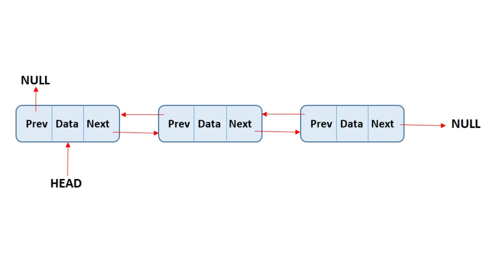

## Linklist
A Link list is a data structure where each data is represented as a node. Each node has a data and a reference to the next node in the sequence. 

### Node 
Link list is made of many nodes. Eevery node contains same types of datas and the refrence to it's next node.

### Head Node
Each Linked List has a head or root node. Head node is the first node of any link list that contains it's data and the reference of the next node. It represents an entire link list. With out a head node we cannot access the link list or other node.

### Null Pointer
In order to end a link list we need a null pointer index. Null value is the stoping position that indicates the list has ended. 

## Single Link list
The above image is a single link list. A single link list is where each node has only one refrence to it's next node.

## Doubly Link list
A doubly list list is where each node has two refrence for both it's previous node and it's next node. 

The head node's previous node is null and the last node's next node is also pointed to null.

## Circular Link list
The circular link is where the last node is pointed towards the head node, making a circle.

For Circular Doubly Link List the head node's previous node is poineted to last node and last node's next node is pointed to head node.

